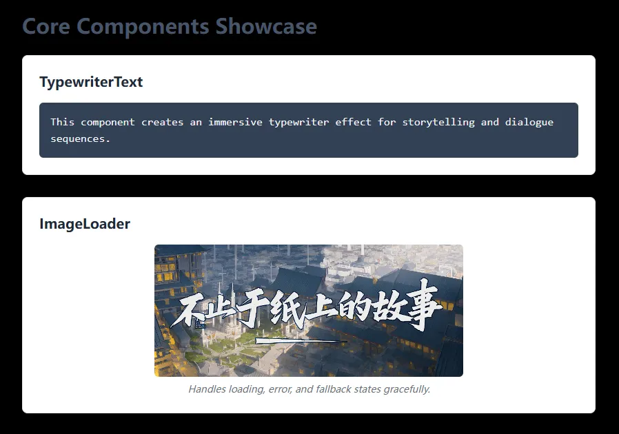

# Carrot Web Game Template


A simple, modular, and extensible web game template based on React, TypeScript, and Vite. Designed for rapid prototyping and building games for platforms like **itch.io** and **GitHub Pages**.

> **Note**: For detailed technical documentation, please refer to our **[Full Documentation](./docs/README.md)**.

> **[➡️ Try the Live Demo!](https://tobenot.top/Basic-Web-Game/)**



Play Beyond Books on Itch.io based on this project!

[](https://tobenot.itch.io/beyond-books)

---

## Why Carrot Web Game Template?

While you can always build a project from scratch with `create-react-app`, this template is specifically optimized for web game development, saving you from common setup headaches:

-   **Game-Centric Architecture**: Separates the core engine (`carrot`) from game-specific logic (`games`), promoting organized, reusable code.
-   **One-Command Deployments**: Built-in scripts for **itch.io** and **GitHub Pages** that automatically handle tricky path configurations, letting you focus on your game.
-   **Essential Components Included**: Comes with pre-built, customizable components like `ImageLoader`, `TypewriterText`, and `GameShell` for aspect ratio and screen orientation control.

## 🗺️ Roadmap & TODO

This template is actively evolving. Here are the key features planned for the near future. Contributions are highly welcome!

-   [ ] **Core Systems**
    -   [ ] **LLM/AI Integration**: A generic module for calling large language models, enabling dynamic narrative and NPC interactions.
    -   [ ] **Audio Manager**: A robust service for handling background music and sound effects.
    -   [ ] **Localization (i18n) System**: A simple framework for supporting multiple languages.
-   [ ] **Performance Optimization**: Focus on code splitting and asset optimization for faster load times.
-   [ ] **Backend Support**: Develop a companion backend template for handling player data or game state persistence. (Vision: [Basic-Web-Game-Backend](https://github.com/tobenot/Basic-Web-Game-Backend))

## ✨ Features

-   **Modular Architecture**: Core engine (`carrot`) is separated from game-specific logic (`games`).
-   **React + TypeScript**: Modern, type-safe UI development with reusable core components.
-   **Vite Powered**: Fast development server and optimized builds.
-   **Automated Deployments**:
    -   Built-in script (`npm run build:itch`) to version, build, and package your game for **itch.io**.
    -   Streamlined deployment to **GitHub Pages** via `npm run deploy`.
-   **Easy to Customize**: A clean starting point for your next web game.

## 🚀 Getting Started

### Prerequisites

-   Node.js 18+
-   npm or yarn

### Installation & Development

1.  Clone this repository or use it as a template.
2.  Install dependencies:
    ```bash
    npm install
    ```
3.  Start the development server:
    ```bash
    npm run dev
    ```
    Your game will be running at `http://localhost:5173`.

## 📦 Building for Production

To create a production-ready build, run:
```bash
npm run build
```
This will generate a `dist` directory with all your game files.

-   **For itch.io**: Use `npm run build:itch`. This command automatically versions, builds, and packages your game into a `.zip` file, ready for upload.
-   **For GitHub Pages**: Before deploying, ensure the `name` field in `package.json` matches your GitHub repository name. Then, use `npm run deploy`.

> For more details on build commands and local testing, see the [Build and Deployment section in our documentation](./docs/05-build-and-deploy.md).

## 📂 Project Structure

```
/
├── dist/               # Production build output
├── docs/               # Detailed project documentation
├── public/             # Static assets (images, fonts, config files)
│   └── version.json    # Auto-versioning for itch.io builds
├── src/                # Source code
│   ├── carrot/         # The core engine/template
│   ├── games/          # Houses all specific game projects
│   └── ...
├── scripts/
│   └── build-itch.js   # Script for versioning and packaging for itch.io
├── .github/            # GitHub-specific files (e.g., workflows)
└── ...
```

A more detailed breakdown of the project structure is available in [our documentation](./docs/02-project-structure.md).

## 🎨 Customization

To create your own game, follow the detailed guide in [our documentation](./docs/04-creation-and-extension.md).

## 🤝 Contributing

Contributions are welcome! If you have ideas for improvements or find a bug, please first read our **[Contribution Guide](./docs/06-contributing.md)** and check out the issues page.

### 💡 Help Wanted

We are actively looking for help in the following areas:
-   **More Core Components**: Ideas for reusable UI or logic components (e.g., `SoundManager`, `SpriteAnimation`).
-   **Documentation**: Improving existing docs or adding translations.
-   **Game Samples**: Creating more diverse game examples to showcase the engine's capabilities.

## 📄 License

This project is licensed under the MIT License. See the [LICENSE](LICENSE) file for details.
